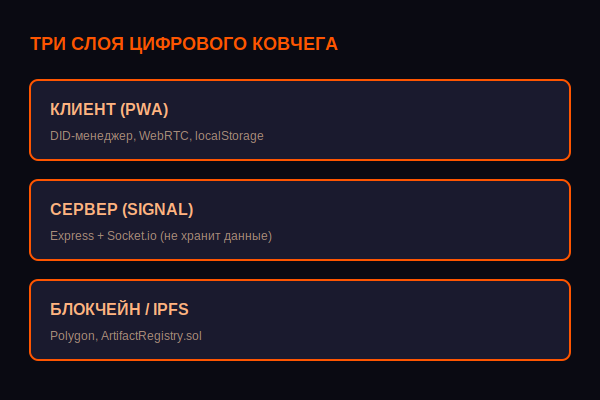
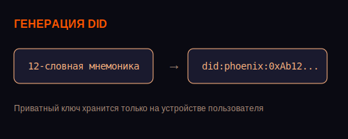

# Как мы строим децентрализованный «Цифровой Ковчег» (и почему отказались от инвестиций)

Привет, Хабр! Мы — небольшая команда энтузиастов, которая последние полгода разрабатывает некоммерческий Open Source проект «Феникс» ([phoenixsearch.ru](https://phoenixsearch.ru)). Это не очередной стартап с раундом инвестиций, не приложение для медитаций и не крипто-хайп. Мы строим **цифровой дом, который невозможно заблокировать**, где пользователь сам владеет своей идентичностью, а общение идёт напрямую, без центрального сервера.

В этом посте я честно расскажу, как устроен наш проект изнутри, с какими техническими и идеологическими вызовами мы столкнулись, и почему мы осознанно идём против течения.

## От «Сада» до «Ковчега»: история трансформации
Изначально мы называли проект «Садом» и позиционировали его как пространство для осознанности и медитаций. Но после первых же аудитов (в том числе от читателей Хабра) мы поняли: люди устали от эзотерики. Им нужна конкретика и реальная защита своих данных.

Так родился **«Цифровой Ковчег»** — инструмент для суверенной цифровой жизни. Мы убрали всю «философию» из интерфейса и сосредоточились на главном:
- **Суверенная идентичность (DID)** — ты сам генерируешь ключи, и они хранятся только у тебя.
- **Прямые P2P-коммуникации** — общение идёт напрямую, без серверов, которые можно прослушать.
- **Децентрализованное хранение** — твои артефакты и творчество записываются в блокчейн и не могут быть удалены.

Мы перестали быть «философами» и стали инженерами, которые решают конкретную задачу: **вернуть человеку контроль над его цифровой жизнью**.

## Архитектура: как устроен Ковчег
Наш проект состоит из трёх слоёв, каждый из которых отвечает за свою часть безопасности.



### 1. Клиентский слой (PWA)
Работает офлайн, поддерживает 7 языков. Именно здесь генерируется **12-словная мнемоника (BIP39)**, из которой извлекается пара ключей Ed25519.

**Важно:** приватный ключ хранится только на устройстве пользователя (`localStorage`) и никогда не отправляется на сервер.



```javascript
// Генерация DID на клиенте
const wallet = ethers.Wallet.createRandom();
const mnemonic = wallet.mnemonic.phrase; // 12 слов
const did = `did:phoenix:${wallet.address}`; // Уникальный идентификатор
2. Серверный слой (Signal)
Node.js + Express + Socket.io. Сервер выполняет единственную роль — помогает установить P2P-соединение (обмен SDP и ICE-кандидатами).

Сервер не хранит сообщения, файлы или историю. Вся пользовательская коммуникация идёт напрямую между браузерами через WebRTC.

3. Слой данных
Локальное хранилище (localStorage) — для профиля, целей и настроек.

Блокчейн (Polygon Mumbai testnet) — для регистрации артефактов. Смарт-контракт ArtifactRegistry.sol уже развёрнут локально.

Технические вызовы и наши решения
Мы прошли через классические боли стартапов: падающий фронтенд, битые базы данных, кеширование, которое сводило с ума. Но мы научились на своих ошибках и внедрили несколько критических практик, которые спасли проект.

Модульная архитектура
Каждая функция (DID, Круг, Мастерская) вынесена в отдельный JS-файл. Это позволяет менять части системы, не роняя всё приложение. Хочешь обновить чат? Меняешь circle.js, не трогая academy.js.

Авто-деплой через GitHub
Мы настроили CI/CD: каждый пуш в main автоматически обновляет VPS (cron + git pull). Теперь правки не требуют ручного копирования файлов. Разработчик пушит код, и через 5 минут он на проде.

Кеш-бастинг
Чтобы браузеры всегда загружали свежие версии, мы добавляем ?v=2 к статическим ресурсам. Это спасло нас от «невидимых» изменений, когда правки на сервере есть, а браузер показывает старую версию.

Почему мы не берём инвестиции и как планируем жить
Мы принципиально отказались от внешнего финансирования. Почему? Потому что любой инвестор рано или поздно потребует «монетизировать аудиторию». А это значит — собирать данные, вводить подписки, ломать приватность.

Мы выбрали другой путь — модель Open Source Bounty.

На странице /bounties мы создали витрину задач, где каждый может профинансировать конкретную функцию. Например, сейчас открыта задача «Интеграция P2P-видеозвонков» с бюджетом 1000 USDT.

Это не инвестиция. Это целевое пожертвование на развитие открытого кода. Мы не продаём доли, не обещаем прибыль. Мы просто выполняем работу, которую оплатило сообщество.

Первые пользователи и сообщество
Боты не станут нашими пользователями. Мы начали с личных приглашений и публикации кода на GitHub. Чтобы новички могли быстро влиться, мы сделали:

Страницу сообщества (/community) с прямыми ссылками на репозиторий и Круг Первопроходцев.

Честный README.md с дорожной картой, лицензией MIT и пометкой «Мы — некоммерческий проект».

Публичный whitepaper с техническими деталями архитектуры.

Первые 10-20 живых пользователей, которые заинтересованы в приватности, — вот наша цель. Мы не гонимся за миллионами. Мы строим дом для тех, кому он нужен.

Что дальше? Дорожная карта
В ближайших планах:

End-to-end шифрование текстовых сообщений (на базе открытых ключей DID).

Мобильное PWA с полноценной поддержкой звонков и офлайн-режима.

Токенизированная репутация (Proof-of-Benefit) на Polygon — вознаграждение за реальный вклад в экосистему.

Присоединяйтесь к Ковчегу
Мы строим инструмент для всех, кто устал от слежки и хочет вернуть контроль над своей цифровой жизнью. Если вы разработчик, дизайнер, тестировщик или просто идейный человек — заходите.

Сайт: phoenixsearch.ru

GitHub: github.com/v4g7yz29g7-coder/phoenix-space

Витрина задач: phoenixsearch.ru/bounties

Давайте строить будущее вместе. Оно должно быть свободным. 🐦‍🔥
