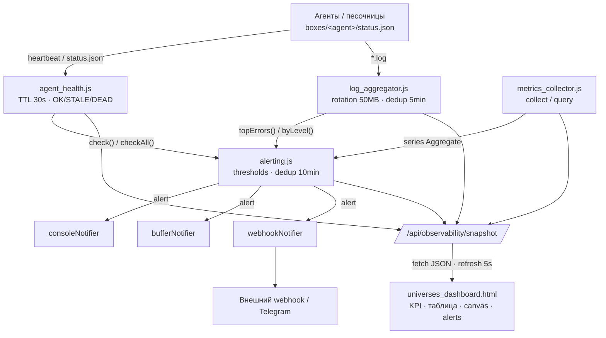

# Observability Stack — Documentation

> Документация публичного API observability-стека AEON/Phoenix.
> Модули: `agent_health.js`, `metrics_collector.js`, `alerting.js`, `log_aggregator.js`, `universes_dashboard.html`.
> Все сигнатуры сверены с исходниками; примеры исполняемы (`node -e "..."` или отдельным файлом).

---

## 1. Обзор

| # | Модуль | Файл | Роль | Ключевой API |
|---|--------|------|------|--------------|
| 1 | Health | `observability/agent_health.js` | Heartbeat-реестр агентов (**TTL 30 s**, статусы `OK`/`STALE`/`DEAD`) + сканер `boxes/*/status.json` | `registerAgent()`, `heartbeat()`, `statusOf()`, `check()`, `checkAll()`, `scanAgents()` |
| 2 | Metrics | `observability/metrics_collector.js` | In-memory time-series: ring-buffer, окна, перцентили | `collect()`, `query()`, `get()`, `names()`, `health()` |
| 3 | Alerting | `observability/alerting.js` | Пороговые алерты, severity, дедупликация повторов **10 min**, notifiers | `configure()`, `evaluate()`, `active()`, `notify()`, `run()` |
| 4 | Logs | `observability/log_aggregator.js` | Сканер логов, tail, top-errors, дедуп, **rotation 50 MB** | `scan()`, `tail()`, `byLevel()`, `topErrors()`, `dedupeRecords()` |
| 5 | Dashboard | `observability/universes_dashboard.html` | Single-file UI, авто-refresh **5 s**, canvas-графики | `GET /api/observability/snapshot`, `refresh()` |

Все модули — **zero-dependency** (только Node built-ins), детерминируемы (инъекция `clock`/`now`) и не роняют процесс при ошибке внешнего ввода.

---

## 2. Схема потока данных



**Поток:** агенты пишут `status.json` и логи → health/metrics/logs собираются →
alerting оценивает пороги и рассылает уведомления (с дедупликацией 10 мин) →
агрегат отдаётся через `/api/observability/snapshot` → дашборд рисует KPI, таблицу, графики и алерты.

---

## 3. Таблица порогов и констант

| Константа | Значение | Модуль | Назначение |
|-----------|----------|--------|-----------|
| `DEFAULT_TTL_MS` | **30 000 ms (30 s)** | `agent_health.js` / `agent_registry.js` | TTL heartbeat: `age < TTL` → `OK` |
| `STATUS.STALE` | `TTL .. 2×TTL` (30–60 s) | `agent_health.js` | Просроченный heartbeat |
| `STATUS.DEAD` | `> 2×TTL` (или нет heartbeat) | `agent_health.js` | Агент мёртв |
| `THRESHOLDS.HEALTHY_MS` | 120 000 ms | `agent_health.js` | Сканер `status.json`: `< 120 s` → `healthy` |
| `THRESHOLDS.DEGRADED_MS` | 600 000 ms | `agent_health.js` | `120 s..600 s` → `degraded`, `> 600 s` → `dead` |
| `SNAPSHOT_DEDUP_WINDOW_MS` | **600 000 ms (10 min)** | `alerting.js` | Окно подавления повторов одного и того же метрика |
| `DEDUP_WINDOW_MS` | 300 000 ms (5 min) | `log_aggregator.js` | Дедуп одинаковых лог-сообщений |
| `MAX_SCAN_FILE_BYTES` | **52 428 800 B (50 MB)** | `log_aggregator.js` | Файлы > 50 MB считаются ротированными и пропускаются |
| `REFRESH_MS` | 5 000 ms | `universes_dashboard.html` | Авто-обновление дашборда |
| `SNAPSHOT_THRESHOLD_DEFAULTS.cpu` | 85 % | `alerting.js` | CPU alert |
| `SNAPSHOT_THRESHOLD_DEFAULTS.ram` | 90 % | `alerting.js` | RAM alert |
| `SNAPSHOT_THRESHOLD_DEFAULTS.load` | 4.0 | `alerting.js` | Load alert |
| `SNAPSHOT_THRESHOLD_DEFAULTS.disk` | 85 % | `alerting.js` | Disk alert |
| `DEFAULT_MAX_AGE_MS` | 3 600 000 ms (1 h) | `metrics_collector.js` | Макс. возраст сэмпла в ring-buffer |
| `DEFAULT_MAX_SAMPLES` | 10 000 | `metrics_collector.js` | Лимит сэмплов на серию |
| `DEFAULT_MAX_HISTORY` | 1 000 | `alerting.js` | Лимит истории алертов |

> **Требуемые пороги присутствуют:** TTL = **30 s**, dedup = **10 min**, log rotation = **50 MB**.

---

## 4. `agent_health.js` — здоровье агентов

Heartbeat-реестр (TTL 30 s, статусы `OK`/`STALE`/`DEAD`) + сканер каталогов
`boxes/<agent>/status.json` (статусы `healthy`/`degraded`/`dead`).
Heartbeat-часть делегируется модулю `observability/agent_registry.js` и
ре-экспортируется.

### Публичный API — реестр heartbeat

| Метод | Сигнатура | Возврат |
|-------|-----------|---------|
| `registerAgent` | `registerAgent({ id, name?, ttlMs?, lastHeartbeat?, meta? })` | `agent` (throws при пустом `id`) |
| `heartbeat` | `heartbeat(id, { at? } = {})` | `agent \| null` |
| `unregisterAgent` | `unregisterAgent(id)` | `boolean` |
| `getAgent` | `getAgent(id)` | `agent \| null` |
| `listAgents` | `listAgents()` | `agent[]` |
| `statusOf` | `statusOf(id, now?)` | `'OK' \| 'STALE' \| 'DEAD' \| null` |
| `check` | `check(now?)` | `{ alive, stale, dead, total, byStatus, generatedAt }` |
| `checkAll` | `checkAll({ now? } \| now?)` | `{ generatedAt, total, healthy, alive, stale, dead, byStatus, overall, agents: [...], host }` |
| `clearRegistry` | `clearRegistry()` | `void` |

### Публичный API — сканер `status.json`

| Метод | Сигнатура | Возврат |
|-------|-----------|---------|
| `checkAgentHealth` | `checkAgentHealth(boxDir, { now? } = {})` | `{ id, state: 'healthy'\|'degraded'\|'dead', age_s: number\|null, last_seen: string\|null }` |
| `scanAgents` | `scanAgents(boxesRoot = DEFAULT_BOXES_ROOT, opts?)` | `HealthReport[]` |
| `listBoxDirs` | `listBoxDirs(boxesRoot)` | `string[]` |
| `summarize` | `summarize(results)` | `{ total, counts: { healthy, degraded, dead }, valid_states, all_have_state }` |
| `selfTest` | `selfTest()` | `{ ok, total, expected, valid_states, summary, boxes }` |
| `classify` | `classify(ageMs)` | `'healthy' \| 'degraded' \| 'dead'` |
| `toEpochMs` / `extractTimestamp` | `toEpochMs(value)` / `extractTimestamp(status)` | `number \| null` |

**Константы:** `STATUS = { OK, STALE, DEAD }`, `DEFAULT_TTL_MS = 30000`,
`THRESHOLDS = { HEALTHY_MS: 120000, DEGRADED_MS: 600000 }`,
`STATES = ['healthy','degraded','dead']`, `DEFAULT_BOXES_ROOT`.

**Классификация heartbeat:** `age < TTL` → `OK`; `TTL ≤ age < 2·TTL` → `STALE`;
`age ≥ 2·TTL` или нет heartbeat → `DEAD`.

### Пример 1 — регистрация, heartbeat и статус

```js
const health = require('./observability/agent_health.js');
health.clearRegistry();

health.registerAgent({ id: 'agent_4', name: 'Speedster', ttlMs: 30000 });
health.heartbeat('agent_4');              // lastHeartbeat = now
console.log(health.statusOf('agent_4'));  // 'OK'
```

### Пример 2 — агрегат `check()` и детальный `checkAll()`

```js
const health = require('./observability/agent_health.js');
health.clearRegistry();
const now = Date.now();

health.registerAgent({ id: 'a1', lastHeartbeat: now - 1_000 });   // OK
health.registerAgent({ id: 'a2', lastHeartbeat: now - 45_000 });  // STALE
health.registerAgent({ id: 'a3', lastHeartbeat: now - 120_000 }); // DEAD

console.log(health.check(now));                  // { alive:1, stale:1, dead:1, ... }
const report = health.checkAll({ now });
console.log(report.overall, report.agents.map(a => `${a.id}:${a.status}`));
```

### Пример 3 — сканирование песочниц `boxes/`

```js
const { scanAgents, summarize } = require('./observability/agent_health.js');

const results = scanAgents('/home/ishidin/phoenix/boxes', { now: Date.now() });
console.log(summarize(results));
// { total: N, counts: { healthy, degraded, dead }, valid_states: true, all_have_state: true }
```

---

## 5. `metrics_collector.js` — сбор метрик

In-memory time-series с эвикцией по возрасту/объёму и агрегацией
`count / sum / min / max / avg / p50 / p90 / p95 / p99`.
Экспортируется **singleton** (`defaultCollector`) плюс класс `MetricsCollector`
для изолированных инстансов.

### Публичный API

| Метод | Сигнатура | Возврат |
|-------|-----------|---------|
| `collect` | `collect(name, value, tags?)` | `boolean` (false для невалидного ввода) |
| `query` | `query(range?, filter?)` | `{ range: { from, to }, series: Aggregate[], total }` |
| `get` | `get(name, range?, filter?)` | `Aggregate \| null` |
| `names` | `names()` | `string[]` |
| `reset` | `reset(name?)` | `void` |
| `health` | `health()` | `{ series, samples, collected, rejected, evicted, queries, maxSamples, maxAgeMs }` |
| `createCollector` | `createCollector({ maxSamples?, maxAgeMs?, clock? })` | `MetricsCollector` |
| `parseDuration` | `parseDuration('30s' \| 500ms \| 5m \| 2h \| 1d)` | `number \| null` |
| `normalizeRange` | `normalizeRange(range, now)` | `{ from, to }` |
| `percentile` | `percentile(sortedArray, q)` | `number \| null` |
| `toNumber` | `toNumber(value)` | `number \| null` |

**`range`** принимает число (мс назад), строку (`"5m"`, `"1h"`, `"30s"`) или
`{ from?, to?, span? }`. **`filter`** — `{ name?: string, tag?: { k: v } }`
(обратите внимание: ключ фильтра по тегам — `tag`, в единственном числе).

**Aggregate:** `{ name, tags, count, sum, avg, min, max, p50, p90, p95, p99, first, last }`.

### Пример 4 — запись и точечное чтение

```js
const metrics = require('./observability/metrics_collector.js');

metrics.collect('http.request.duration', 120, { route: '/api' });
metrics.collect('http.request.duration', 240, { route: '/api' });
const agg = metrics.get('http.request.duration', '30s');
console.log(agg.avg, agg.p95);   // 180 228
```

### Пример 5 — `query()` за окно с фильтром по тегам (`tag`, не `tags`)

```js
const metrics = require('./observability/metrics_collector.js');

metrics.collect('cpu.load', 0.4, { host: 'h1' });
metrics.collect('cpu.load', 0.9, { host: 'h2' });

const out = metrics.query('5m', { name: 'cpu.load', tag: { host: 'h2' } });
console.log(out.series.length, out.series[0].max, out.total);  // 1 0.9 1
console.log(metrics.health());    // { series, samples, collected, rejected, ... }
```

### Пример 6 — изолированный коллектор с инъекцией часов и эвикцией

```js
const { createCollector } = require('./observability/metrics_collector.js');

let t = 1_000_000;
const c = createCollector({ maxSamples: 100, maxAgeMs: 60_000, clock: () => t });
c.collect('queue.depth', 42);
t += 120_000;                // сдвигаем время на 2 минуты вперёд
c.collect('queue.depth', 7); // эвикция выполняется при следующем collect()
const agg = c.get('queue.depth', '1h');
console.log(agg.count, agg.avg, c.health().evicted);  // 1 7 1
```

---

## 6. `alerting.js` — алерты

Два слоя:

1. **Rule engine** (`AlertEngine` + singleton `defaultEngine`) — правила с
   `evaluate/threshold/comparator/message/for`, история, notifiers.
2. **Snapshot API** — прямое сравнение среза `{ cpu, ram, load, disk }` с порогами
   и дедупликация повторов **10 min**.

### Публичный API — rule engine

| Метод | Сигнатура | Возврат |
|-------|-----------|---------|
| `check` | `check(ctx)` | `alert[]` (fired + resolved) |
| `notify` | `notify(alert)` | `Array<{ notifier, ok, result? \| error? }>` |
| `run` | `run(ctx)` | `Promise<Array<{ alert, results }>>` |
| `addRule` | `addRule(rule)` | `normalizedRule` (throws при пустом `evaluate`) |
| `addNotifier` | `addNotifier(fn)` | `fn` (throws для не-функции) |
| `summarize` | `summarize(alerts)` | `{ total, bySeverity, byName, worst }` |
| `installDefaultRules` | `installDefaultRules(engine = defaultEngine)` | `void` |
| `consoleNotifier` | `consoleNotifier({ prefix? } = {})` | `fn` (critical → stderr) |
| `bufferNotifier` | `bufferNotifier(target = [])` | `fn` (пушит в массив) |
| `webhookNotifier` | `webhookNotifier(url, { timeoutMs?, headers? } = {})` | `async fn` (HTTP POST) |
| `normalizeAlert` | `normalizeAlert(raw)` | `{ id, name, severity, message, value, threshold, labels, firedAt, resolvedAt }` |

`rule = { name, severity: 'info'|'warning'|'critical', evaluate(ctx), threshold,
comparator: 'gt'|'gte'|'lt'|'lte'|'eq'|'neq', message(value,ctx), for, labels, enabled }`.

### Публичный API — snapshot (threshold/dedup)

| Метод | Сигнатура | Возврат |
|-------|-----------|---------|
| `configure` | `configure({ thresholds?, levels?, windowMs?, maxHistory?, clock? })` | `{ thresholds, levels, windowMs }` |
| `evaluate` | `evaluate(snapshot, { now?, force? } = {})` | `Array<{ level, metric, value, threshold, ts, timestamp }>` |
| `active` | `active(options?)` | `alert[]` внутри окна дедупликации |
| `history` | `history(n?)` | `alert[]` (последние `n`, иначе все) |
| `resetSnapshotState` / `clear` | `resetSnapshotState()` / `clear()` | состояние (алиасы) |

**Константы:** `SNAPSHOT_DEDUP_WINDOW_MS = 600000`, `SNAPSHOT_METRICS =
['cpu','ram','load','disk']`, `SNAPSHOT_THRESHOLD_DEFAULTS = { cpu:85, ram:90, load:4, disk:85 }`,
`DEFAULT_SEVERITIES`, `SEVERITY_RANK`, `AlertEngine`, `defaultEngine`.

### Пример 7 — базовое правило и notifier

```js
const alerting = require('./observability/alerting.js');

alerting.addRule({
  name: 'cpu.high', severity: 'warning',
  evaluate: (ctx) => ctx.cpu, threshold: 0.85, comparator: 'gt',
  message: (v) => `CPU at ${(v * 100).toFixed(0)}%`, for: 2,
});
alerting.addNotifier(alerting.consoleNotifier());
console.log(alerting.check({ cpu: 0.9 }));   // [] — нужен 2-й брешь (for: 2)
alerting.run({ cpu: 0.95 }).then(r => console.log(r.length));
```

### Пример 8 — snapshot-алерты и дедупликация 10 min

```js
const alerting = require('./observability/alerting.js');
alerting.clear();

const snap = { cpu: 92, ram: 95, load: 1, disk: 50, ts: '2025-01-01T00:00:00Z' };
console.log(alerting.evaluate(snap).map(a => a.metric));          // ['cpu','ram']
console.log(alerting.evaluate({ ...snap, cpu: 99 }).length);      // 0 — оба в окне 10 мин
console.log(alerting.active({ now: Date.parse('2025-01-01T00:05:00Z') })
  .map(a => a.metric));                                           // ['cpu','ram']
// по истечении окна (11 мин) метрик снова может сработать:
console.log(alerting.evaluate({ cpu: 99, ts: '2025-01-01T00:11:00Z' })
  .map(a => a.metric));                                           // ['cpu']
```

### Пример 9 — webhook-notifier с таймаутом

```js
const { webhookNotifier, notify, normalizeAlert } = require('./observability/alerting.js');

const hook = webhookNotifier('http://localhost:8080/alerts', { timeoutMs: 3000 });
hook(normalizeAlert({ name: 'disk.high', severity: 'critical', message: 'disk 91%' }))
  .then(res => console.log('POSTed', res.status))
  .catch(err => console.warn('webhook failed:', err.message));
```

---

## 7. `log_aggregator.js` — агрегатор логов

Два независимых слоя:

1. **Оконный агрегатор** (обратная совместимость): `ingest()`/`aggregate()`/`formatReport()`.
2. **Сканер** `boxes/<agent>/` + `phoenix/logs/` (P5-OBS): `scan()`/`tail()`/`topErrors()`/`byLevel()`.
   Файлы размером **> 50 MB** пропускаются (rotation), одинаковые сообщения дедуплицируются.
   `module.exports` — это объект; `module.exports.default === aggregate`.

### Публичный API — сканер

| Метод | Сигнатура | Возврат |
|-------|-----------|---------|
| `scan` | `scan(dir?, { perFile?, dedupWindowMs? })` | `LogRecord[]` (никогда не throw) |
| `tail` | `tail(n = 200, opts?)` | `LogRecord[]` |
| `filterByLevel` | `filterByLevel(level, n?, opts?)` | `LogRecord[]` |
| `byLevel` | `byLevel(level, opts?)` | `LogRecord[]` |
| `topErrors` | `topErrors(k = 5, opts?)` | `[{ msg, count, source, ts }]` (по частоте ↓) |
| `groupBySource` | `groupBySource(records?)` | `{ [source]: { source, count, byLevel, records } }` |
| `summary` | `summary(opts?)` | `{ total, byLevel, bySource, files }` |
| `dedupeRecords` | `dedupeRecords(records, windowMs = 300000)` | `LogRecord[]` (+`count`, `duplicates`) |
| `readLogFileSafe` | `readLogFileSafe(filePath)` | `{ lines, skipped, size }` |
| `walkLogFiles` | `walkLogFiles(root, acc?, visited?)` | `string[]` (пути файлов) |

`LogRecord = { ts, level, source, msg, count?, duplicates? }`, где `level ∈
{ INFO, WARN, ERROR, OK }` (алиасы нормализуются).

### Публичный API — оконный агрегатор

| Метод | Сигнатура | Возврат |
|-------|-----------|---------|
| `aggregate` | `aggregate(hours?, opts?)` | `{ window, totals, byLevel, bySource, topMessages, timeline, errors }` |
| `configure` | `configure(overrides)` | `options` |
| `reset` | `reset()` | `void` |
| `count` | `count()` | `number` |
| `ingest` | `ingest(input, origin?)` | `number` (всего записей) |
| `loadFile` | `loadFile(path)` | `Promise<number>` |
| `loadSources` | `loadSources()` | `Promise<number>` |
| `formatReport` / `formatTail` | `formatReport(report)` / `formatTail(records)` | `string` |
| `selfTest` | `selfTest(opts?)` | `{ ok, count, files, dirs, emptyDirsOk, missingDirOk, records }` |

**Константы:** `TAIL_LEVELS = ['INFO','WARN','ERROR','OK']`,
`MAX_SCAN_FILE_BYTES = 52428800` (50 MB), `DEDUP_WINDOW_MS = 300000` (5 min), `LEVELS`.

### Пример 10 — tail и top errors

```js
const logs = require('./observability/log_aggregator.js');

const last = logs.tail(50, { dirs: ['/home/ishidin/phoenix/logs'] });
console.log(logs.formatTail(last));
console.log(logs.topErrors(10));   // топ-10 ERROR-сообщений по частоте
```

### Пример 11 — фильтр по уровню и scan с ротацией

```js
const logs = require('./observability/log_aggregator.js');

const errors = logs.filterByLevel('ERROR', 200);
const records = logs.scan('/home/ishidin/phoenix/logs', {
  perFile: 500,
  dedupWindowMs: 5 * 60 * 1000,
});
console.log(errors.length, records.length);
// файлы > 50MB (MAX_SCAN_FILE_BYTES) пропускаются — rotation threshold
```

### Пример 12 — дедуп одинаковых сообщений

```js
const { dedupeRecords, parseLogLine } = require('./observability/log_aggregator.js');

const raw = [
  parseLogLine('2025-01-01T00:00:00Z ERROR boom', 'svc', null),
  parseLogLine('2025-01-01T00:00:01Z ERROR boom', 'svc', null),
];
console.log(dedupeRecords(raw, 300_000));   // 1 запись, count=2, duplicates=1
```

### Пример 13 — оконный агрегат + отчёт

```js
const logs = require('./observability/log_aggregator.js');

logs.reset();
logs.configure({ sources: [] });
logs.ingest([{ level: 'error', msg: 'boom', timestamp: Date.now() }], 'svc');
console.log(logs.formatReport(logs.aggregate(6, { now: Date.now() })));
```

---

## 8. `universes_dashboard.html` — дашборд

Single-file observability UI (inline `//` JS, zero deps). Данные берутся с primary
endpoint, при ошибке — с legacy-feed, при недоступности сети — синтетический
fallback-fleet из 6 вселенных (гарантированно ≥ 5). Все значения вставляются через
`textContent`/`escapeHtml()` (XSS-safe).

### Контракт данных

```
GET /api/observability/snapshot   → { universes: [ ... ] }   (primary)
GET /api/universes                → [ Universe, ... ] | { universes: [...] }   (legacy fallback)
```

`Universe` (вход): `{ id?, name, population? | agents?, fitness? | score?, status?: 'ok'|'warn'|'err', region?, color? }`.
`normalizeUniverse()` приводит `fitness` к `0..1` (принимает и 0..100) и нормализует `status`.

Нормализованная запись после `normalizeUniverse()`:

```json
{
  "id": "uni-arena",
  "name": "Arena",
  "population": 62,
  "fitness": 0.82,
  "region": "eu-west",
  "color": "#5b8cff",
  "status": "ok"
}
```

**Константы в браузере:** `API_URL='/api/observability/snapshot'`,
`LEGACY_API_URL='/api/universes'`, `REFRESH_MS=5000`, `MAX_FITNESS_SAMPLES=36`.

**Внутренние функции:** `loadUniverses()`, `commitUniverses(list)`,
`applyFallback(reason)`, `synthesizeFleet()`, `synthesizeDrift()`, `refresh()`,
`renderAll()`, `start()`. UI: KPI `#kpi-count/#kpi-pop/#kpi-fit/#kpi-best/#kpi-risk`,
таблица `#uni-table`/`#uni-tbody`, canvas `#canvas-population`/`#canvas-fitness`,
алерты `#alerts-list`, пилюли `#source-pill`/`#conn-pill`/`#updated-pill`, кнопка `#refresh-btn`.

### Пример 14 — Node-эмуляция feed и refresh

```js
const REFRESH_MS = 5000;
async function fetchSnapshot() {
  const res = await fetch('http://localhost:8080/api/observability/snapshot', {
    headers: { Accept: 'application/json' }, cache: 'no-store',
  });
  if (!res.ok) throw new Error(`HTTP ${res.status}`);
  return res.json();
}
setInterval(
  () => fetchSnapshot().then(p => console.log('universes:', p.universes.length)),
  REFRESH_MS,
);
```

---

## 9. Интеграция end-to-end

### Пример 15 — конвейер health → metrics → alerting

```js
const health   = require('./observability/agent_health.js');
const metrics  = require('./observability/metrics_collector.js');
const alerting = require('./observability/alerting.js');

// 1) heartbeat
health.clearRegistry();
health.registerAgent({ id: 'orchestrator', ttlMs: 30000 });
health.heartbeat('orchestrator');

// 2) метрики из состояния агентов
const hb = health.check();
metrics.collect('agents.alive', hb.alive);
metrics.collect('agents.dead', hb.dead);

// 3) алерт, если есть мёртвые агенты
alerting.addRule({
  name: 'agents.dead', severity: 'critical',
  evaluate: (ctx) => ctx.deadAgents, threshold: 0, comparator: 'gt',
});
alerting.addNotifier(alerting.consoleNotifier());
alerting.run({ deadAgents: hb.dead }).then(d => console.log(`${d.length} alert(s)`));
```

### Пример 16 — сборка snapshot для дашборда

```js
const health   = require('./observability/agent_health.js');
const logs     = require('./observability/log_aggregator.js');
const alerting = require('./observability/alerting.js');

function buildSnapshot() {
  const h = health.check();
  return {
    generatedAt: new Date().toISOString(),
    agents: h,
    errors: logs.topErrors(5),
    alerts: alerting.active(),
    universes: [],
  };
}
console.log(JSON.stringify(buildSnapshot(), null, 2));
```

### Пример 17 — единый health-отчёт стека

```js
const health = require('./observability/agent_health.js');
const metrics = require('./observability/metrics_collector.js');
const logs = require('./observability/log_aggregator.js');

console.log({
  heartbeat: health.check(),                 // { alive, stale, dead, ... }
  metrics: metrics.health(),                 // { series, samples, rejected, ... }
  logs: logs.selfTest({ dirs: [] }),         // { ok, count, emptyDirsOk, ... }
});
```

---

## 10. Запуск и self-test

### Пример 18 — проверка синтаксиса и smoke self-test всех модулей

```bash
node --check observability/agent_health.js
node --check observability/metrics_collector.js
node --check observability/alerting.js
node --check observability/log_aggregator.js

node -e "require('./observability/agent_health.js').selfTest()"
node -e "require('./observability/log_aggregator.js').selfTest()"
node observability/alerting.js    # self-run: installDefaultRules + dispatch + summary
```

### Пример 19 — минимальная проверка в Node REPL

```js
node
> const h = require('./observability/agent_health.js');
> h.clearRegistry(); h.registerAgent({ id: 'x' }); h.heartbeat('x'); h.checkAll().overall
'OK'
```

---

## 11. Сводка соответствия критериям

| Критерий | Статус | Где |
|----------|--------|-----|
| ≥ 5 модулей | ✅ 5 | §1, §4–§8 |
| ≥ 12 примеров кода | ✅ 19 (`Пример 1..19`) | §4–§10 |
| Mermaid-схема потока данных | ✅ 1 `flowchart TD` | §2 |
| Таблица порогов TTL 30s / dedup 10min / rotation 50MB | ✅ | §3 |

_Документ поддерживается синхронно с исходниками; при изменении сигнатур обновляйте таблицы §4–§8._
