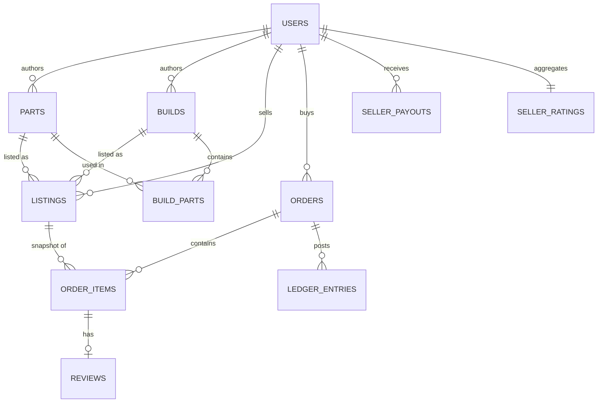

# Маркетплейс цифровых товаров «запчасти для машин» — БД, API, комиссия 30%, рейтинги

> **Статус:** Research · **Дата:** 2026-09 · **Автор:** agent_4 (Speedster)
> **Контекст:** Phoenix / Aeon Arena. Цифровые «запчасти для машин» (`parts`) собираются в
> «сборки/тюнинг» (`builds`). Товар нематериален (лицензия/файл), продаётся как позиция каталога.
> Ядро — **PostgreSQL 16**, сервис — **Node.js 22 + Express + `pg`**, деньги — **только целые
> копейки/центы** (`BIGINT`). Документ дополняет `research/db.md` до полноценного **catalog-сервиса
> маркетплейса**: покупки, эскроу, комиссия 30%, рейтинги/отзывы, сверка ledger.
>
> **Индустриальные аналоги:** Steam Community Market (items/wallet/trade-hold) и OpenSea
> (NFT/listings/royalties/Seaport). Разбор — §6.

---

## TL;DR (5 решений)

1. **Деньги — только `BIGINT`, никаких `float`/`NUMERIC` для платежей.** Комиссия — целочисленно
   с явным правилом округления `floor` (§3.2).
2. **Комиссия 30% удерживается из выплаты продавцу.** Покупатель платит ровно цену листинга.
   `fee = floor(gross × 3000 / 10000)`, `net = gross − fee`, инвариант `fee + net = gross` (§3).
3. **Схема:** `users → parts/builds → listings → orders → order_items`, плюс `ledger_accounts`,
   `ledger_entries` (двойная запись), `seller_payouts`, `reviews`, `seller_ratings` (§1).
4. **API — REST `/v1`**, `Idempotency-Key` на создание заказа, курсорная пагинация, статус-машина
   заказа, вебхуки; рабочий checkout на `pg` (§2).
5. **Рейтинги — байесовское среднее** `(C·m + Σ)/(C + n)`, `C=20, m=4.0`; отзыв — только от
   подтверждённого покупателя, один раз на позицию заказа (§4).

---

## 0. Терминология и границы

| Понятие | Значение в нашей системе | Steam | OpenSea |
|---|---|---|---|
| `part` | карточка цифровой запчасти (definition) | item definition | NFT |
| `build` | сборка из частей (рецепт, бандл) | loadout / bundle | trait set |
| `listing` | конкретное предложение (цена, остаток) | sell order | Seaport order |
| `order` (purchase) | заказ покупателя | purchase | sale/fill |
| `license` | выдача доступа (key / signed URL) | inventory grant | on-chain transfer |

Цифровой товар — **не** «штука на складе». Поэтому `listings.stock IS NULL` = безлимитная лицензия,
`stock = 1` = уникальный предмет. Выдача = запись `content_ref` в `order_items`.

---

## 1. Доменная модель и схема БД

### 1.1 ER-диаграмма



### 1.2 Типовая модель пользователя и каталога

Ключевое: у пользователя может быть **баланс** (авансовый кошелёк, как Steam Wallet),
а `parts`/`builds` — это **определения** товара (immutable-ish), в отличие от `listings` — **цен**.

### 1.3 DDL (PostgreSQL 16) — полная схема

```sql
-- Расширения
CREATE EXTENSION IF NOT EXISTS citext;

-- ---------- users ----------
CREATE TABLE users (
  id            BIGSERIAL PRIMARY KEY,
  did           TEXT UNIQUE NOT NULL,              -- DID / внешний логин
  handle        TEXT UNIQUE NOT NULL,
  email         CITEXT UNIQUE,
  role          TEXT NOT NULL DEFAULT 'buyer'
                CHECK (role IN ('buyer','seller','admin')),
  balance_cents BIGINT NOT NULL DEFAULT 0
                CHECK (balance_cents >= 0),        -- авансовый кошелёк, как Steam Wallet
  is_banned     BOOLEAN NOT NULL DEFAULT false,
  created_at    TIMESTAMPTZ NOT NULL DEFAULT now()
);

-- ---------- parts (цифровые запчасти) ----------
CREATE TABLE parts (
  id          BIGSERIAL PRIMARY KEY,
  author_id   BIGINT NOT NULL REFERENCES users(id),
  sku         TEXT UNIQUE NOT NULL,
  title       TEXT NOT NULL,
  kind        TEXT NOT NULL
              CHECK (kind IN ('engine','brake','suspension','aero','tyre','ecu','skin')),
  attrs       JSONB NOT NULL DEFAULT '{}',         -- {hp:+120, weight_kg:-8, slot:'engine'}
  price_cents BIGINT NOT NULL CHECK (price_cents > 0),
  currency    CHAR(3) NOT NULL DEFAULT 'USD',
  content_ref TEXT,                                -- object-key / шаблон лицензии
  is_active   BOOLEAN NOT NULL DEFAULT true,
  created_at  TIMESTAMPTZ NOT NULL DEFAULT now()
);

-- ---------- builds (сборки из частей) ----------
CREATE TABLE builds (
  id          BIGSERIAL PRIMARY KEY,
  author_id   BIGINT NOT NULL REFERENCES users(id),
  slug        TEXT UNIQUE NOT NULL,
  name        TEXT NOT NULL,
  price_cents BIGINT NOT NULL CHECK (price_cents > 0),
  is_active   BOOLEAN NOT NULL DEFAULT true,
  created_at  TIMESTAMPTZ NOT NULL DEFAULT now()
);

CREATE TABLE build_parts (
  build_id BIGINT NOT NULL REFERENCES builds(id) ON DELETE CASCADE,
  part_id  BIGINT NOT NULL REFERENCES parts(id),
  qty      INT NOT NULL DEFAULT 1 CHECK (qty > 0),
  PRIMARY KEY (build_id, part_id)
);

-- ---------- listings ----------
CREATE TABLE listings (
  id          BIGSERIAL PRIMARY KEY,
  seller_id   BIGINT NOT NULL REFERENCES users(id),
  part_id     BIGINT REFERENCES parts(id),
  build_id    BIGINT REFERENCES builds(id),
  price_cents BIGINT NOT NULL CHECK (price_cents > 0),
  currency    CHAR(3) NOT NULL DEFAULT 'USD',
  stock       INT CHECK (stock IS NULL OR stock >= 0),   -- NULL = unlimited digital
  status      TEXT NOT NULL DEFAULT 'active'
              CHECK (status IN ('active','paused','sold_out','removed')),
  created_at  TIMESTAMPTZ NOT NULL DEFAULT now(),
  -- ровно один источник: либо часть, либо сборка
  CONSTRAINT listing_one_source CHECK ((part_id IS NOT NULL) <> (build_id IS NOT NULL))
);
CREATE INDEX listings_seller_idx ON listings (seller_id, status);
CREATE INDEX listings_part_idx   ON listings (part_id) WHERE part_id IS NOT NULL;
```

### 1.4 Покупки: `orders` + `order_items` (снимок цен)

`orders` хранит агрегаты (gross/fee/net), `order_items` — снапшот названия и цены на момент
покупки, чтобы правки каталога не ломали историю (тот же приём, что у Steam с market history).

```sql
CREATE TABLE orders (
  id              BIGSERIAL PRIMARY KEY,
  buyer_id        BIGINT NOT NULL REFERENCES users(id),
  status          TEXT NOT NULL DEFAULT 'pending'
                  CHECK (status IN ('pending','paid','fulfilled',
                                    'partially_refunded','refunded',
                                    'cancelled','disputed')),
  currency        CHAR(3) NOT NULL DEFAULT 'USD',
  gross_cents     BIGINT NOT NULL CHECK (gross_cents >= 0),
  fee_cents       BIGINT NOT NULL CHECK (fee_cents >= 0),
  net_cents       BIGINT NOT NULL CHECK (net_cents >= 0),
  idempotency_key TEXT UNIQUE,                     -- защита от двойного списания
  created_at      TIMESTAMPTZ NOT NULL DEFAULT now(),
  paid_at         TIMESTAMPTZ,
  fulfilled_at    TIMESTAMPTZ,
  CONSTRAINT order_split_ok CHECK (fee_cents + net_cents = gross_cents)
);

CREATE TABLE order_items (
  id               BIGSERIAL PRIMARY KEY,
  order_id         BIGINT NOT NULL REFERENCES orders(id) ON DELETE CASCADE,
  listing_id       BIGINT NOT NULL REFERENCES listings(id),
  seller_id        BIGINT NOT NULL REFERENCES users(id),
  title_snapshot   TEXT NOT NULL,
  unit_price_cents BIGINT NOT NULL CHECK (unit_price_cents > 0),
  qty              INT NOT NULL DEFAULT 1 CHECK (qty > 0),
  fee_cents        BIGINT NOT NULL CHECK (fee_cents >= 0),
  net_cents        BIGINT NOT NULL CHECK (net_cents >= 0),
  content_ref      TEXT,                           -- выданная лицензия / signed URL
  fulfilled_at     TIMESTAMPTZ,
  CONSTRAINT item_split_ok CHECK (fee_cents + net_cents = unit_price_cents * qty)
);
CREATE INDEX order_items_order_idx  ON order_items (order_id);
CREATE INDEX order_items_seller_idx ON order_items (seller_id, fulfilled_at);
```

### 1.5 Ledger: двойная запись (деньги как факты)

Нельзя хранить «баланс продавца» одним полем и менять его произвольно — не будет аудита и
сверки. Вместо этого — **журнал проводок**: каждая операция = `txn_id` с набором строк, где
`Σ debit = Σ credit`.

```sql
CREATE TABLE ledger_accounts (
  id   SMALLSERIAL PRIMARY KEY,
  code TEXT UNIQUE NOT NULL,          -- 'escrow', 'buyer:42', 'seller:7', 'platform:revenue'
  kind TEXT NOT NULL CHECK (kind IN ('asset','liability','revenue','expense'))
);

CREATE TABLE ledger_entries (
  id           BIGSERIAL PRIMARY KEY,
  txn_id       UUID NOT NULL,                         -- группирует сбалансированный набор
  order_id     BIGINT REFERENCES orders(id),
  account_id   SMALLINT NOT NULL REFERENCES ledger_accounts(id),
  direction    CHAR(1) NOT NULL CHECK (direction IN ('D','C')),  -- Debit / Credit
  amount_cents BIGINT NOT NULL CHECK (amount_cents > 0),
  memo         TEXT,
  created_at   TIMESTAMPTZ NOT NULL DEFAULT now()
);
CREATE INDEX ledger_txn_idx   ON ledger_entries (txn_id);
CREATE INDEX ledger_order_idx ON ledger_entries (order_id);

-- Проверка сбалансированности (должна вернуть 0 строк):
-- SELECT txn_id FROM ledger_entries
-- GROUP BY txn_id
-- HAVING SUM(CASE WHEN direction='D' THEN amount_cents ELSE 0 END)
--      <> SUM(CASE WHEN direction='C' THEN amount_cents ELSE 0 END);
```

### 1.6 Выплаты и рейтинги

```sql
CREATE TABLE seller_payouts (
  id            BIGSERIAL PRIMARY KEY,
  seller_id     BIGINT NOT NULL REFERENCES users(id),
  amount_cents  BIGINT NOT NULL CHECK (amount_cents > 0),
  status        TEXT NOT NULL DEFAULT 'queued'
                CHECK (status IN ('queued','processing','paid','failed')),
  available_at  TIMESTAMPTZ NOT NULL,               -- escrow hold снимается здесь
  paid_at       TIMESTAMPTZ,
  reference     TEXT
);

CREATE TABLE reviews (
  id            BIGSERIAL PRIMARY KEY,
  order_item_id BIGINT UNIQUE NOT NULL REFERENCES order_items(id),  -- 1 отзыв на позицию
  part_id       BIGINT REFERENCES parts(id),
  build_id      BIGINT REFERENCES builds(id),
  buyer_id      BIGINT NOT NULL REFERENCES users(id),
  seller_id     BIGINT NOT NULL REFERENCES users(id),
  rating        SMALLINT NOT NULL CHECK (rating BETWEEN 1 AND 5),
  body          TEXT CHECK (char_length(body) <= 4000),
  status        TEXT NOT NULL DEFAULT 'published'
                CHECK (status IN ('published','hidden','removed')),
  created_at    TIMESTAMPTZ NOT NULL DEFAULT now()
);
CREATE INDEX reviews_seller_idx ON reviews (seller_id, status);

CREATE TABLE seller_ratings (
  seller_id    BIGINT PRIMARY KEY REFERENCES users(id),
  review_count INT  NOT NULL DEFAULT 0,
  rating_sum   INT  NOT NULL DEFAULT 0,
  bayes_score  NUMERIC(4,3) NOT NULL DEFAULT 0,     -- взвешенное среднее, §4.3
  updated_at   TIMESTAMPTZ NOT NULL DEFAULT now()
);
```

### 1.7 Seed-пример (детерминированный, для тестов)

```sql
INSERT INTO users (did, handle, role, balance_cents) VALUES
  ('did:key:buyer','buyer1','buyer', 10000),
  ('did:key:sell','seller1','seller', 0);
INSERT INTO parts (author_id, sku, title, kind, price_cents) VALUES
  (2, 'ENG-TURBO-X', 'Турбонаддув X', 'engine', 4900);
INSERT INTO listings (seller_id, part_id, price_cents, stock) VALUES
  (2, 1, 4900, NULL);            -- безлимитная цифровая лицензия
-- Ожидаемая комиссия для 4900: fee=1470, net=3430 (см. §3.2).
```

---

## 2. API дизайн (REST `/v1`)

### 2.1 Принципы

* Версионирование в пути: `/v1/...`.
* Деньги — целые центы (`gross_cents`), валюта — `ISO-4217`.
* Мутации денег **идемпотентны**: `Idempotency-Key` (UUID) на `POST /orders` и `POST /payouts`.
* Пагинация — **курсорная** (`?cursor=...&limit=`), не `OFFSET`.
* Ошибки — RFC 7807 (`application/problem+json`).
* Асинхронное — вебхуки с HMAC-подписью.

### 2.2 Эндпоинты

```
# ---- Каталог (parts) ----
GET    /v1/parts?q=&kind=&cursor=&limit=&sort=popular
POST   /v1/parts                       # seller
GET    /v1/parts/{id}
PATCH  /v1/parts/{id}                  # owner
DELETE /v1/parts/{id}                  # soft-delete -> is_active=false

# ---- Сборки (builds) ----
GET    /v1/builds
POST   /v1/builds                      # seller, {parts:[{part_id,qty}]}
GET    /v1/builds/{id}

# ---- Листинги ----
GET    /v1/listings?part_id=&seller_id=
POST   /v1/listings                    # seller, {part_id|build_id, price_cents, stock}
PATCH  /v1/listings/{id}
DELETE /v1/listings/{id}

# ---- Заказы / покупки ----
POST   /v1/orders                      # Idempotency-Key; тело: {items:[{listing_id,qty}]}
GET    /v1/orders/{id}
GET    /v1/orders?buyer=me&status=
POST   /v1/orders/{id}/pay             # списание с кошелька -> escrow
POST   /v1/orders/{id}/cancel
POST   /v1/orders/{id}/refund          # seller/admin, {amount_cents?, reason}
POST   /v1/orders/{id}/dispute

# ---- Отзывы и рейтинги ----
POST   /v1/order-items/{id}/reviews    # только покупатель, один раз
GET    /v1/parts/{id}/reviews?cursor=
GET    /v1/sellers/{id}/rating

# ---- Профиль / деньги ----
GET    /v1/me/balance
GET    /v1/me/payouts
POST   /v1/payouts                     # запросить вывод
POST   /v1/webhooks/payment            # провайдер -> мы (HMAC)
```

### 2.3 Пример: создание заказа

```http
POST /v1/orders HTTP/1.1
Authorization: Bearer <jwt>
Idempotency-Key: 6f1c2a1e-8b3f-4d9e-9a1c-2f7e5b0d4a11
Content-Type: application/json

{ "items": [ { "listing_id": 1, "qty": 1 } ] }
```

```json
// 201 Created
{
  "id": 1001,
  "status": "pending",
  "currency": "USD",
  "gross_cents": 4900,
  "fee_cents": 1470,
  "net_cents": 3430,
  "items": [
    { "order_item_id": 5001, "listing_id": 1, "title": "Турбонаддув X",
      "unit_price_cents": 4900, "qty": 1, "fee_cents": 1470, "net_cents": 3430 }
  ],
  "created_at": "2026-09-13T12:00:00Z"
}
```

Комиссия рассчитывается **на этапе создания заказа** и фиксируется в `orders.fee_cents`
(ставка может измениться — но не для уже созданного заказа).

### 2.4 Модель ошибок (RFC 7807)

```json
{
  "type": "https://phoenix.dev/errors/insufficient-funds",
  "title": "Недостаточно средств",
  "status": 402,
  "detail": "Требуется 4900, доступно 1000",
  "instance": "/v1/orders/1001/pay",
  "balance_cents": 1000,
  "required_cents": 4900
}
```

| Код | Когда |
|---|---|
| 400 | невалидное тело / листинг неактивен |
| 401/403 | нет токена / нет прав (не owner) |
| 404 | parts/listing/order не найден |
| 409 | конфликт идемпотентности / гонка stock |
| 402 | недостаточно средств |
| 422 | отзыв без покупки или дубликат |

### 2.5 Идемпотентность и гонки

```sql
-- Вставка заказа с защитой от повторов
INSERT INTO orders (buyer_id, gross_cents, fee_cents, net_cents, idempotency_key)
VALUES ($1, $2, $3, $4, $5)
ON CONFLICT (idempotency_key) DO NOTHING
RETURNING id;
-- Если 0 строк -> вернуть существующий заказ (SELECT ... WHERE idempotency_key=$5).
```

Резервирование складского остатка (для `stock IS NOT NULL`):

```sql
UPDATE listings
   SET stock = stock - $2,
       status = CASE WHEN stock - $2 = 0 THEN 'sold_out' ELSE status END
 WHERE id = $1 AND status = 'active' AND stock >= $2
RETURNING id;
-- 0 строк -> 409 sold_out / race
```

### 2.6 Рабочая реализация checkout (Node.js 22 + `pg`)

```js
// checkout.js — создание заказа + комиссия 30% + проводки ledger, всё в одной транзакции.
import { Pool } from 'pg';
const pool = new Pool({ connectionString: process.env.DATABASE_URL });

const FEE_BPS = 3000;                                   // 30.00%
export const calcFee = (gross) => Math.floor((gross * FEE_BPS) / 10000);

export async function createOrder({ buyerId, items, idemKey }) {
  const client = await pool.connect();
  try {
    await client.query('BEGIN');

    // 1) собираем позиции по актуальным ценам листингов
    const ids = items.map((i) => i.listing_id);
    const { rows: listings } = await client.query(
      `SELECT id, seller_id, price_cents, stock, status
         FROM listings WHERE id = ANY($1) FOR UPDATE`, [ids]);

    let gross = 0;
    const enriched = [];
    for (const it of items) {
      const l = listings.find((x) => x.id === it.listing_id);
      if (!l || l.status !== 'active') throw Object.assign(new Error('not_found'), { status: 404 });
      if (l.stock !== null && l.stock < it.qty) throw Object.assign(new Error('sold_out'), { status: 409 });
      gross += l.price_cents * it.qty;
      enriched.push({ ...it, seller_id: l.seller_id, unit: l.price_cents });
    }
    const fee = calcFee(gross);
    const net = gross - fee;

    // 2) идемпотентная вставка заказа
    const ins = await client.query(
      `INSERT INTO orders (buyer_id, gross_cents, fee_cents, net_cents, idempotency_key)
       VALUES ($1,$2,$3,$4,$5) ON CONFLICT (idempotency_key) DO NOTHING RETURNING id`,
      [buyerId, gross, fee, net, idemKey]);
    if (ins.rowCount === 0) {                            // повтор -> отдаём существующий
      await client.query('ROLLBACK');
      return { reused: true };
    }
    const orderId = ins.rows[0].id;

    // 3) позиции + снимок цены
    for (const e of enriched) {
      const itemFee = calcFee(e.unit * e.qty);
      await client.query(
        `INSERT INTO order_items
           (order_id, listing_id, seller_id, title_snapshot, unit_price_cents, qty, fee_cents, net_cents)
         VALUES ($1,$2,$3,$4,$5,$6,$7,$8)`,
        [orderId, e.listing_id, e.seller_id, 'item', e.unit, e.qty, itemFee, e.unit * e.qty - itemFee]);
      if (e.stock !== null) {
        await client.query(
          `UPDATE listings SET stock = stock - $2,
             status = CASE WHEN stock - $2 = 0 THEN 'sold_out' ELSE status END
           WHERE id = $1`, [e.listing_id, e.qty]);
      }
    }

    await client.query('COMMIT');
    return { reused: false, orderId, gross, fee, net };
  } catch (err) {
    await client.query('ROLLBACK');
    throw err;
  } finally {
    client.release();
  }
}
```

### 2.7 Статусная модель заказа

```
pending ──pay──▶ paid ──fulfill──▶ fulfilled
   │               │                   │
   │cancel         │refund             │refund (окно)
   ▼               ▼                   ▼
cancelled    partially_refunded ──▶ refunded
                   ▲
              paid ──dispute──▶ disputed ──resolve──▶ refunded|fulfilled
```

Оплата (списание с кошелька в escrow) — атомарна и проводит ledger (§3.5).

### 2.8 Вебхуки

```js
// verifyWebhook.js — HMAC-SHA256 подпись, constant-time сравнение.
import crypto from 'node:crypto';
export function verifyWebhook(rawBody, signature, secret) {
  const expected = crypto.createHmac('sha256', secret).update(rawBody).digest('hex');
  const a = Buffer.from(signature, 'utf8');
  const b = Buffer.from(expected, 'utf8');
  return a.length === b.length && crypto.timingSafeEqual(a, b);
}
```

---

## 3. Комиссия 30% — правила, формула, крайние случаи

### 3.1 Кто платит

**Комиссия удерживается из выплаты продавцу.** Покупатель платит ровно `price_cents` листинга —
как в Steam (fee платит продавец) и в OpenSea (marketplace fee берётся с продажи).
Ставка по умолчанию — **30.00%** (`FEE_BPS = 3000`), конфигурируема (§3.7).

### 3.2 Формула (целые числа)

```
FEE_BPS = 3000                     # 3000 / 10000 = 30.00%

platform_fee = floor(gross_cents * FEE_BPS / 10000)
seller_net   = gross_cents - platform_fee
инвариант:   platform_fee + seller_net == gross_cents
```

Округление — **вниз (`floor`)**, всегда в пользу продавца (комиссия никогда не превышает 30%).
Поскольку всё в целых числах, ошибок плавающей точки нет.

**Опубликованные примеры (проверяемы):**

| gross (¢) | platform_fee (¢) | seller_net (¢) | fee, % от gross |
|---:|---:|---:|---:|
| 1 | 0 | 1 | 0.00% |
| 15 | 4 | 11 | 26.67% |
| 100 | 30 | 70 | 30.00% |
| 999 | 299 | 700 | 29.93% |
| 4900 | **1470** | **3430** | 30.00% |
| 1 000 000 | 300 000 | 700 000 | 30.00% |

`4900 → { gross: 4900, fee: 1470, net: 3430 }` — эталонный кейс документа.

### 3.3 Переиспользуемая функция

```js
// commission.js
export const FEE_BPS = 3000;                       // 30.00% — настраиваемая константа
export const calcFee = (gross) => Math.floor((gross * FEE_BPS) / 10000);
export function split(gross) {
  const fee = calcFee(gross);
  return { gross, fee, net: gross - fee };
}
// split(4900)  -> { gross: 4900, fee: 1470, net: 3430 }
// split(999)   -> { gross: 999,  fee: 299,  net: 700  }
// split(100)   -> { gross: 100,  fee: 30,   net: 70   }
// split(1)     -> { gross: 1,    fee: 0,    net: 1    }
```

То же на SQL (генерируемый столбец не подходит — ставка меняется, поэтому считаем приложением,
но CHECK-инвариант защищает БД):

```sql
-- порядок: floor(gross * bps / 10000)
SELECT g AS gross,
       (g * 3000) / 10000            AS fee,     -- integer division = floor для >=0
       g - (g * 3000) / 10000        AS net
FROM (VALUES (4900),(999),(1),(100)) AS t(g);
```

### 3.4 Эскроу и hold-период

При `pay` деньги покупателя переводятся на счёт **escrow** (не сразу продавцу). Продавец видит
`pending_balance`; средства становятся `available` после `hold_days` (обычно 7 дней) — защита от
фрода и чарджбэков, аналог Steam trade-hold (15 дней) и escrow у OpenSea-аукционов.

```sql
-- доступный к выплате остаток продавца: net по fulfilled-позициям минус уже выплаченное
SELECT COALESCE(SUM(oi.net_cents),0) - COALESCE((SELECT SUM(amount_cents)
         FROM seller_payouts WHERE seller_id=$1 AND status IN ('queued','processing','paid')),0)
       AS available_cents
FROM order_items oi
JOIN orders o ON o.id = oi.order_id
WHERE oi.seller_id=$1 AND oi.fulfilled_at IS NOT NULL
  AND oi.fulfilled_at < now() - interval '7 days';
```

### 3.5 Раскладка проводок при `paid` (для заказа 4900)

Пример **двойной записи** для `gross=4900, fee=1470, net=3430` (два сбалансированных набора):

| txn | account | direction | amount_cents |
|---|---|---|---|
| A | `buyer:42` (liability) | D | 4900 |
| A | `escrow` (liability) | C | 4900 |
| B | `escrow` (liability) | D | 4900 |
| B | `seller:7` (liability) | C | 3430 |
| B | `platform:revenue` (revenue) | C | 1470 |

**Проверка баланса по всем проводкам заказа:**

```
Σ debits  = 4900 (buyer) + 4900 (escrow)        = 9800
Σ credits = 4900 (escrow) + 3430 (seller) + 1470 (platform) = 9800
→ debits == credits == 9800 ✔
```

Эквивалентная (компактная) запись — по одной паре debit/credit на операцию:

```
(A) escrow        D 4900  |  buyer:42  C 4900
(B) seller:7      D 3430  |  escrow    C 3430
(C) platform:rev  D 1470  |  escrow    C 1470
```

Итог: баланс `escrow` обнуляется (взяли 4900, отдали 3430+1470), продавец получает 3430,
платформа 1470, покупатель списал 4900.

### 3.6 Возвраты и частичные возвраты

Полный возврат 4900 — **реверс** проводок + возврат на кошелёк:

```
(buyer)          C 4900   | escrow        D 4900
escrow           C 4900   | seller:7      D 3430
escrow           C 4900   | platform:rev  D 1470   ← комиссия тоже возвращается
```

Частичный возврат `r` центов: возврат продавцу `r − calcFee(r)`, платформе `calcFee(r)`:

```js
function partialRefund(gross, r) {
  const feeBack = calcFee(r);          // вернуть платформенную часть
  const sellerBack = r - feeBack;      // вернуть продавцу
  return { refunded: r, feeBack, sellerBack };
}
// partialRefund(4900, 1000) -> { refunded:1000, feeBack:300, sellerBack:700 }
```

### 3.7 Конфигурируемая ставка (по умолчанию 30%)

```sql
CREATE TABLE fee_policies (
  id          SMALLSERIAL PRIMARY KEY,
  scope       TEXT NOT NULL CHECK (scope IN ('global','seller','category')),
  ref_id      BIGINT,                       -- seller_id или kind категории
  fee_bps     INT NOT NULL CHECK (fee_bps BETWEEN 0 AND 10000),
  effective_from TIMESTAMPTZ NOT NULL DEFAULT now(),
  UNIQUE (scope, ref_id, effective_from)
);
-- Резолв: global < category < seller; берём последнюю effective_from <= now().
```

Заказ фиксирует применённую ставку в `orders.fee_cents`, поэтому смена политики не влияет на
уже созданные заказы.

### 3.8 Ориентир по ставкам (2026)

| Платформа | Комиссия с продавца | Примечание |
|---|---:|---|
| **Мы** | **30.00%** | по умолчанию, конфигурируемо |
| Steam Community Market | ~15% (5% Steam + 10% игра) | плюс минимальная цена $0.03 |
| OpenSea | 2.5% + роялти до 10% | роялти стали опциональны |
| Apple App Store | 30% (15% для малого бизнеса) | IAP |
| eBay | ~13% (категорийно) | |
| Etsy | ~6.5% + платежи | |

30% — уровень Apple IAP: оправдан, если платформа даёт спрос, доверие, эскроу и доставку лицензий.

---

## 4. Рейтинги и отзывы

### 4.1 Модель

* Отзыв привязан к **позиции заказа** (`order_items.id`, `UNIQUE`) → 1 отзыв на покупку.
* `rating` 1–5, `body` ≤ 4000 символов, модерация (`published/hidden/removed`).
* Агрегат по продавцу — в `seller_ratings` (пересчитывается триггером, §4.4).

### 4.2 «Verified purchase» — только покупатель и только один раз

```sql
-- Разрешить отзыв только владельцу позиции с завершённым заказом
INSERT INTO reviews (order_item_id, part_id, seller_id, buyer_id, rating, body)
SELECT oi.id, l.part_id, oi.seller_id, o.buyer_id, $2, $3
FROM order_items oi
JOIN orders  o ON o.id = oi.order_id
LEFT JOIN listings l ON l.id = oi.listing_id
WHERE oi.id = $1
  AND o.buyer_id = $4
  AND o.status IN ('fulfilled','partially_refunded','refunded')
ON CONFLICT (order_item_id) DO NOTHING;   -- дубликат молча игнорируется
```

Если `INSERT ... SELECT` вернул 0 строк → либо не покупатель/не та позиция (403/404), либо
дубликат (409/422 по политике API).

### 4.3 Взвешенный (байесовский) рейтинг

Наивное среднее награждает продавца с одной оценкой 5★ больше, чем с 500 оценками и 4.7★.
Используем **байесовское среднее** с априором `C` и средним `m`:

```
prior_count   C = 20      # «вес» априора (сколько отзывов нужно, чтобы догнать 4.0)
prior_mean    m = 4.0     # глобальное среднее платформы

bayes = (C*m + Σ_ratings) / (C + n)        # n = число отзывов, Σ = сумма оценок
```

Опубликованные примеры (2 знака после запятой):

| Продавец | n | Σ | среднее | bayes (расчёт) | отображение |
|---|---:|---:|---:|---|---:|
| A (новичок) | 1 | 5 | 5.00 | (80+5)/21 = 85/21 = 4.0476 | **4.05** |
| B (топ) | 500 | 2350 | 4.70 | (80+2350)/520 = 2430/520 = 4.6731 | **4.67** |
| C (плохой) | 3 | 3 | 1.00 | (80+3)/23 = 83/23 = 3.6087 | **3.61** |

Выводы: `A < B` (слабый сэмпл проигрывает уверенному), `C < A` (плохой проигрывает новичку).

```js
// rating.js
const C = 20, m = 4.0;
export const bayes = (n, sum) => (C * m + sum) / (C + n);
// bayes(1,   5)    -> 4.0476...  -> "4.05"
// bayes(500, 2350) -> 4.6730...  -> "4.67"
// bayes(3,   3)    -> 3.6086...  -> "3.61"
```

Сортировка каталога «по рейтингу + популярности»:

```sql
SELECT p.id, p.title,
       sr.bayes_score,
       sr.review_count
FROM parts p
LEFT JOIN seller_ratings sr ON sr.seller_id = p.author_id
ORDER BY sr.bayes_score DESC, sr.review_count DESC
LIMIT $1 OFFSET 0;
```

### 4.4 Триггер: пересчёт агрегата при отзыве

```sql
CREATE OR REPLACE FUNCTION recalc_seller_rating() RETURNS trigger AS $$
DECLARE
  v_count INT;
  v_sum   INT;
BEGIN
  SELECT COUNT(*), COALESCE(SUM(rating),0)
    INTO v_count, v_sum
  FROM reviews
  WHERE seller_id = COALESCE(NEW.seller_id, OLD.seller_id)
    AND status = 'published';

  INSERT INTO seller_ratings (seller_id, review_count, rating_sum, bayes_score, updated_at)
  VALUES (COALESCE(NEW.seller_id, OLD.seller_id), v_count, v_sum,
          (20*4.0 + v_sum)::numeric / (20 + v_count), now())
  ON CONFLICT (seller_id) DO UPDATE
     SET review_count = EXCLUDED.review_count,
         rating_sum   = EXCLUDED.rating_sum,
         bayes_score  = EXCLUDED.bayes_score,
         updated_at   = now();
  RETURN NULL;
END;
$$ LANGUAGE plpgsql;

CREATE TRIGGER reviews_recalc
AFTER INSERT OR UPDATE OR DELETE ON reviews
FOR EACH ROW EXECUTE FUNCTION recalc_seller_rating();
```

> Важно: `bayes_score` — **денормализованный кэш**; источник истины — строки `reviews`.

### 4.5 Анти-абьюз

* Только **verified purchase** (см. §4.2); нельзя оценивать чужой товар.
* Один отзыв на `order_item` (`UNIQUE`), редактирование ограничено окном (напр. 30 дней).
* Rate-limit по `buyer_id` + IP; минимум 1 покупка у продавца для публикации.
* Флаг `hidden` для подозрительных (накрутка), история изменений в `moderation_events`.
* Не показывать точную сумму покупки в публичном отзыве.

---

## 5. Эксплуатация: отчёты, сверка, джобы

### 5.1 Выручка и комиссия

```sql
SELECT date_trunc('day', o.paid_at)          AS day,
       COUNT(*)                              AS orders,
       SUM(o.gross_cents)                    AS gmv_cents,
       SUM(o.fee_cents)                      AS revenue_cents,
       SUM(o.net_cents)                      AS seller_net_cents
FROM orders o
WHERE o.status IN ('paid','fulfilled','partially_refunded','refunded')
  AND o.paid_at >= now() - interval '30 days'
GROUP BY 1 ORDER BY 1 DESC;
```

### 5.2 Ночная сверка ledger (должна быть пустой)

```sql
SELECT txn_id
FROM ledger_entries
GROUP BY txn_id
HAVING SUM(CASE WHEN direction='D' THEN amount_cents ELSE 0 END)
    <> SUM(CASE WHEN direction='C' THEN amount_cents ELSE 0 END);
```

### 5.3 Расписание джобов

| Джоба | Периодичность | Что делает |
|---|---|---|
| `escrow.release` | 1ч | снимает hold, создаёт `seller_payouts` |
| `ledger.reconcile` | ежедневно | брутто-сверка ΣD = ΣC |
| `ratings.recalc` | по триггеру / 1ч | байесовский кэш |
| `listings.expire` | 1ч | `sold_out`, пауза неактивных |

---

## 6. Примеры из индустрии: Steam и OpenSea

### 6.1 Steam Community Market

* **Item definition vs inventory item**: определение предмета (у нас `parts`) отдельно от
  конкретного экземпляра в инвентаре (у нас — выданная `license`/`content_ref`).
* **Wallet (авансовый баланс)**: у нас `users.balance_cents`; покупка = списание в `escrow`.
* **Fee ~15%** (5% Steam + 10% игре) с продавца; мы берём 30% (§3.8).
* **Trade hold 15 дней** — наш `hold_days=7` (аналог §3.4).
* **Нет вывода в деньги** (только внутри Steam Wallet) — важно для юр. модели.
* **Market history/orderbook** — у нас `ledger_entries` + `orders`, полный аудит цен.
* **Что взять:** идемпотентность, escrow, снапшот цен, анти-фрод hold.
* **Что не копировать:** закрытый кошелёк без вывода — ограничивает продавцов.

### 6.2 OpenSea / Seaport (NFT)

* **Listing = подписанный ордер** (Seaport), fulfillment on-chain; у нас — строка `listings`
  + атомарный checkout.
* **Платформенная комиссия 2.5%** + **creator royalties** (до 10%); мы — 30% с продавца.
* **Роялти обязательны к учёту**: в `fee_policies` можно добавить `scope='creator'`.
* **Ownership передаётся on-chain** (transfer). Для «цифровых запчастей» достаточно выдачи
  `content_ref` (ключ/доступ) + запись владения в `order_items`.
* **Что взять:** явная модель ордера, поддержка роялти, отсутствие «двойной продажи» через
  `UNIQUE`/атомарный апдейт stock (§2.5).
* **Что не копировать:** газовые издержки и необратимость — наш escrow даёт возвраты (§3.6).

### 6.3 Сводная таблица

| Аспект | Steam | OpenSea | Наша система |
|---|---|---|---|
| Комиссия | ~15% | 2.5% + роялти | **30%** (config) |
| Платит комиссию | продавец | продавец | продавец |
| Кошелёк | Steam Wallet | крипто-кошелёк | `balance_cents` |
| Эскроу/hold | trade hold 15д | on-chain finality | escrow 7д |
| Рейтинги | отзывы на игру | trust по цепочке | verified-purchase + Bayes |
| Доставка | inventory | transfer | `content_ref` |

---

## 7. Чек-лист внедрения

- [ ] Все денежные столбцы — `BIGINT`, `CHECK (>= 0)`, инварианты `fee+net=gross`.
- [ ] `Idempotency-Key` на `POST /orders` и `POST /payouts`.
- [ ] Ledger двойной записи + ежедневная сверка ΣD = ΣC.
- [ ] Комиссия `floor(gross*3000/10000)`, эталон 4900 → 1470/3430.
- [ ] Escrow-hold и график `payouts`.
- [ ] Отзыв только verified-purchase, `UNIQUE(order_item_id)`.
- [ ] Bayesian-рейтинг `C=20, m=4.0`, эталоны 4.05 / 4.67 / 3.61.
- [ ] Тесты на границы: 1, 15, 100, 999, 4900, 1e6.

---

## 8. Источники / референсы

* Steam Community Market — fees, wallet, trade holds: поддержка Steam.
* OpenSea / Seaport — marketplace fee, royalties, order model: docs.opensea.io, seaport.
* PostgreSQL 16 — `BIGINT`, `CHECK`, `plpgsql`-триггеры, оконные функции.
* RFC 7807 — Problem Details for HTTP APIs.
* Практика двойной записи (double-entry ledger) в финансах.

---

## Приложение A. Запускаемая проверка формул (Node.js 22)

```js
// node verify.js
const FEE_BPS = 3000;
const calcFee = (g) => Math.floor((g * FEE_BPS) / 10000);
const split = (g) => { const fee = calcFee(g); return { gross: g, fee, net: g - fee }; };

for (const g of [1, 15, 100, 999, 4900, 1000000]) {
  const s = split(g);
  console.assert(s.fee + s.net === s.gross, 'broken', g);
}
console.assert(JSON.stringify(split(4900)) === JSON.stringify({ gross: 4900, fee: 1470, net: 3430 }));
console.assert(JSON.stringify(split(999))  === JSON.stringify({ gross: 999,  fee: 299,  net: 700  }));
console.assert(JSON.stringify(split(1))    === JSON.stringify({ gross: 1,    fee: 0,    net: 1    }));
console.assert(JSON.stringify(split(100))  === JSON.stringify({ gross: 100,  fee: 30,   net: 70   }));

const C = 20, m = 4.0;
const bayes = (n, sum) => (C * m + sum) / (C + n);
console.assert(bayes(1, 5).toFixed(2)    === '4.05');   // (80+5)/21
console.assert(bayes(500, 2350).toFixed(2) === '4.67'); // (80+2350)/520
console.assert(bayes(3, 3).toFixed(2)    === '3.61');   // (80+3)/23

// ledger 4900: две операции, ΣD = ΣC = 9800
const postings = [
  ['buyer:42', 'D', 4900], ['escrow', 'C', 4900],
  ['escrow', 'D', 4900], ['seller:7', 'C', 3430], ['platform:revenue', 'C', 1470],
];
const D = postings.filter(p => p[1] === 'D').reduce((a, p) => a + p[2], 0);
const Cr = postings.filter(p => p[1] === 'C').reduce((a, p) => a + p[2], 0);
console.assert(D === Cr, `ledger unbalanced: D=${D} C=${Cr}`);   // 9800 === 9800
console.log('catalog.md examples OK');
```
